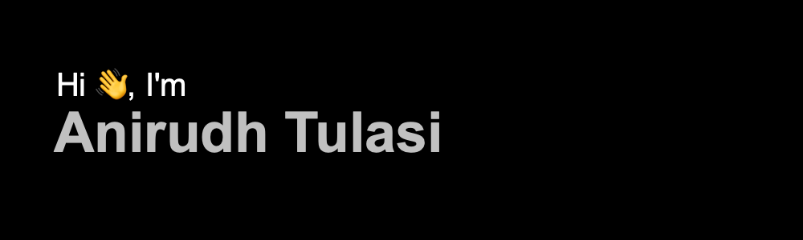

	

	

<!---

	

--->

## 👨🏻‍💻 &nbsp;About Me:

🎓 &nbsp;I'm currently a Gradute Student studying Masters in Computer Engineering at <a href = "https://www.ucr.edu">University of California, Riverside</a>.

🔭 &nbsp;I’ve worked as a Machine Learning Engineer at <a href="http://www.cancermoonshot.in">CancerMoonShot</a>.

💡 &nbsp;I like to solve algorithmic problems or work on my side projects during my free time.

🌱 &nbsp;I'm currently learning more about Systems Design, Parallel and High Performance Computing.

💬 &nbsp;Feel free to reach out to me for work opportunities or working alogside a project.

<!---
🧩 &nbsp;Please have a look at my <a href="https://drive.google.com/file/d/1kf_H6cOm7AcuRvEcbExztr9ie5qTGeiL/view?usp=sharing">Résumé</a> for more details about me.
--->

 

## 🛠 &nbsp;Tech Stack:

### 💻 &nbsp;Languages:

&nbsp;
&nbsp;
&nbsp;
&nbsp;
&nbsp;
&nbsp;
&nbsp;
&nbsp;

### 🚀 &nbsp;Technologies:

&nbsp;
&nbsp;
&nbsp;
&nbsp;
&nbsp;
&nbsp;
&nbsp;

## 📈 Statistics

 

  
  

## 📕 Pinned Repositories

	
	
	
	

